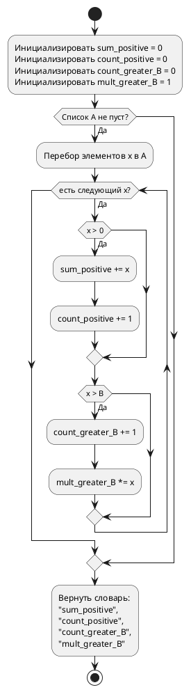

```plantuml

@startuml
start
:Инициализировать sum_positive = 0\nИнициализировать count_positive = 0\nИнициализировать count_greater_B = 0\nИнициализировать mult_greater_B = 1;
if (Список A не пуст?) then (Да)
  :Перебор элементов x в A;
  while (есть следующий x?) is (Да)
    if (x > 0) then (Да)
      :sum_positive += x;
      :count_positive += 1;
    endif
    if (x > B) then (Да)
      :count_greater_B += 1;
      :mult_greater_B *= x;
    endif
  endwhile
endif
:Вернуть словарь:
"sum_positive",
"count_positive",
"count_greater_B",
"mult_greater_B";
stop
@enduml

```